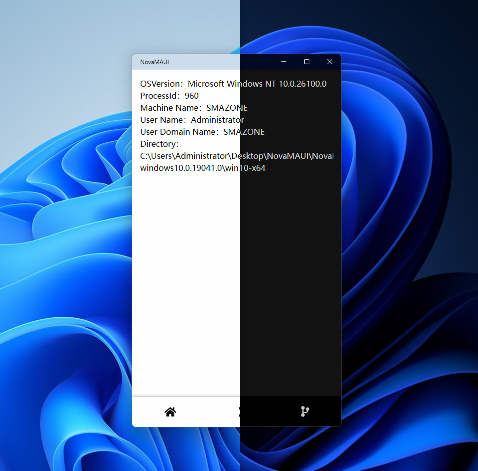
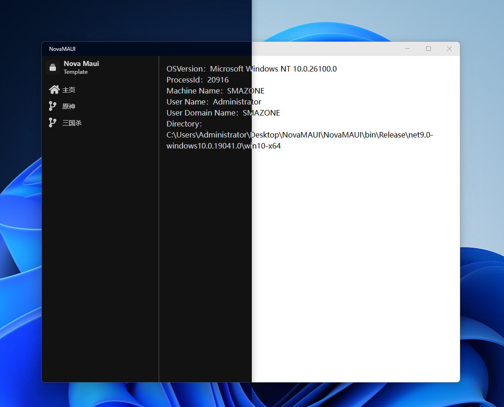

# NovaMAUI
一个用MAUI+Blazor开发的跨平台应用程序框架，可以直接在此基础上构建出多样化的现代跨平台应用程序
## 快速开始
克隆源代码
`git clone https://github.com/NovaConnect/NovaMAUI.git`
使用`Visual Studio 2022`打开项目，选择合适的平台进行构建

然后...
构建你自己的跨平台应用程序
## 预览

